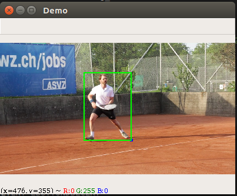
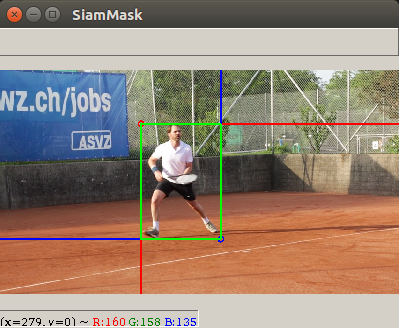
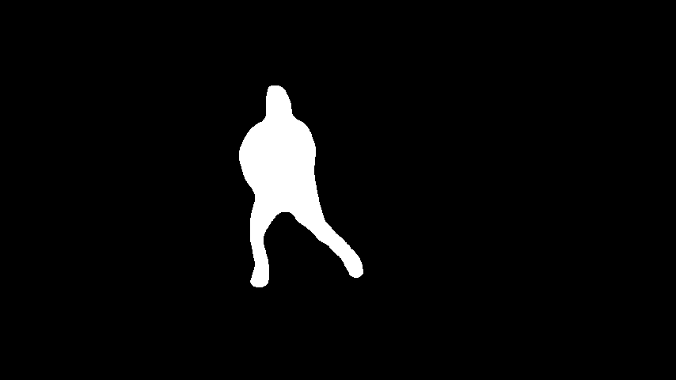

# Environment #
* OS: ubuntu 16.04
* CPU Resource: Inter(R) Core(TM) i7-6700 CPU @ 3.40GHz
* GPU Resource: GTX 1080ti 1x
* Docker Version: 19.03.8
* Version: 2.0

# Directory #
~~~
├── demo.sh

├── docker_setting.sh

├── Siammask_sharp
    ├── SiamMask_DAVIS.pth
    ├── config
    ├── models
    ├── tools
    └── utils
        
├── OnionPeel
    ├── OPN.pth
    └── TCN.pth

├── data
    └── tennis
        ├── OPN.MP4                 (Video File)
        └── *.jpg

└── results(${DATA_NAME})
    ├── final
        └── *.jpg
    ├── masks : Binary mask
        └── *.png
    ├── masks2 : Color mask in input images
        └── *.png
    ├── input.gif
    ├── final.gif
    ├── mask.gif
    └── mask2.gif
~~~
Directory name | role
---------------|-------
masks          | Extract binary mask
masks2         | Color(cyan) mask in input images
final          | Output through Siammask and OPN
# Update #
1. Update docker image(torch 0.4.1 -> torch 1.0.0) in <a href="https://hub.docker.com/repository/docker/khosungpil/sds">dockerhub</a>
2. Add <b>video_preprocessing</b> code to make images per frame for matching input in siammask_sharp
3. Add <b>padding</b> from input initial frame in guidance module
4. Add various options in demo.sh

Options            | role
-------------------|------
DATA_NAME          | folder name in "./data" directory
VIDEO_SCALE_FACTOR | For translating high-resolution video to low-resolution image per frame with resizing images, (default=0.25)
PADDING_FACTOR     | In guidance module, pad image_size * padding_factor, (default=0.05)  ex) 320 x 240 images, 0.05 padding_factor -> 16 x 12 pad
OPN_DILATE_FACTOR  | preprocess to raw_mask with dilation, (default=3)
OPN_SCALE_FACTOR   | you can resize again from images per frame to fit memory, (default=1)

# Usage #
## Requirement ## 
* Recommend using nvidia-docker

### Docker version ###
1. xhost local:root
2. Edit MOUNTED_PATH where code file is in docker_setting.sh 
3. Run docker_setting.sh
~~~
bash docker_setting.sh
~~~
4. Go to /sds/ in activated container.
5. If you have a video file, then run python demo.sh with line 19(python video_preprocess.py ~). You will acquire images per frame from video.
   * You can add video extension in line 23, extension_list in video_preprocess.py,  default: '.mov', 'MOV', '.MP4'

### Pretrained model ###
model | path | Hyperlink
------|------|----------
SiamMask_DAVIS | ./Siammask_sharp | <a href="https://drive.google.com/file/d/1EebLJU0QVi322BYnL7uwHFTOYsm5tTDB/view?usp=sharing">[Download]</a> 
OPN |./OnionPeel/| <a href="https://drive.google.com/file/d/1o-NQPsPac5AZixlDkxhm34bOOcy-2Zn6/view?usp=sharing">[Download]</a>
TCN |./OnionPeel/| <a href="https://drive.google.com/file/d/1MUM_OH7yIjm2KShZJ4stmA6dXEuX-5jd/view?usp=sharing">[Download]</a>

## Demo ##
1. You can edit various option in demo.sh

2. Run ./demo.sh in docker container
~~~
bash demo.sh
~~~

2. Select bounding box
   * If occurs yellow pad
3. When press 'a' in keyboard, then determine bounding box.

4. When press 'b' in keyboard, then inference each models.
5. You can check the masks in the {$DATA_NAME}/masks throught Siammask
6. You can check the results in the {$DATA_NAME}/final throught Onion-peel
7. Finally, you can check the gif file in the {$DATA_NAME}

# Reference #

[CVPR 2019] Fast Online Object Tracking and Segmentation: A Unifying Approach
<a href="https://github.com/foolwood/Siammask">[Github]</a>
 
[ICCV 2019] Onion-Peel Networks for Deep Video Completion
<a href="https://github.com/seoungwugoh/opn-demo">[Github]</a>